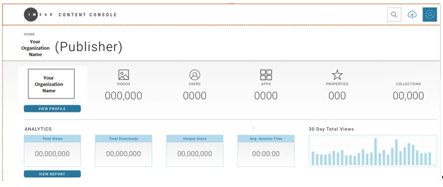
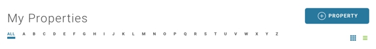
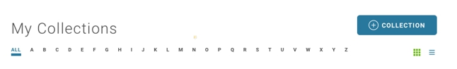

# Publishing a Video using the Content Console

The Content Console offers a flexible video publishing platform where you can tailor your configuration workflow based on your requirements and availability of your video digital assets. During the video publishing process videos reside in the *Production Area* until they are Published.

For example, if you upload a video, perform management tasks (i.e., add description, key art, etc.), but one or more of the digital assets is not available, the video is stored the Production Area. When you add the additional assets and **Publish** the video, the video is removed from the Production Area.

The following tutorial illustrates how to publish a video using the Content Console.

## Step 1: Launch the Content Console

1. Launch the Content Console and log in using your credentials. The *Home* page displays.

## Step 2: Define Video Property

The first step in the video publishing process is to define a Property. A Property has the following characteristics:

* A Property represents the top-level branding element of your videos (e.g., TV Network).
* A video must be added directly to a Property.
* A list of available Properties display on the Content Console Home page.
* A video can be reassigned to a different Property after it is uploaded.

**To define a property:**

1. On the **Home** go to **My Properties**.

2. Select **+Property**. The *Add Property* pop-up displays.
3. Enter the Property name and description, then **OK**. The *Property* page displays.

## Step 3: Define Video Collection

Within each Property you then define a Collection:

- A Collection is a sub-category of a Property (e.g., TV Series Name).
- After adding a new video asset, you then assign it to a Property and Collection.
- Videos in a Collection can be reordered.
- You can reassign a video to a different Property and Collection.
- Within each Collection you also define a Season that represents a subcategory of the collection (i.e. episode #, etc.)

To define a collection:

1. In **Home > Property**, select **+Collection**. The *Add Collection* pop-up displays.

3. Enter the Collection name, description, and seasons, then **OK**. The *Collection* page displays.

## Step 4: Add Video

The add video process involves selecting a video type and specifying camera label, URL, and video format details.

* Supported video formats include **MP4 HD (1040p)**, and **MP4 (4K)**.
* Supported video types include **On Demand (VOD)** and **Live Stream**.
* Drag & Drop or Browse upload method is used for VOD videos.
* Link to external URL is used to add Live Stream videos.
* Each external URL is annotated with a unique camera label.
* For live stream with multiple camera angles, you can add multiple URL with unique camera labels.

**To add a video:**

1. Go to the **My Collections** section and select **Add a New Video**. The *Upload Video* page displays.
2. Select the **Video Type** (Video on Demand or Live Stream).

For Video On Demand:
1. Use the **Drag and Drop** or **Browse** method to perform the upload.

For Live Stream:
1. Use the **Link to an External URL** option.
2. Select video formats MP4 HD (1040p) or MP4 (4K).
2. If you are using multiple camera angles, add an external URL for each angle and add a descriptive Camera Label to identify the link.

## Step 5: Set Season and Property

After you upload your video, you have the option to change the Property and group the video in a Season.

1. Go to **Set Season and Property**. The Property associated with the current video displays.
2. If you would like to reassign the current video to a new Property, select it from the drop-down and also select a Season.
3. Select **Next** to continue, or **Save for Later** to commit your changes and resume publishing this video at a later time. Your video will display in the Production Area on the **Home**. page.

## Step 6: Define Video Metadata

- Metadata is used to uniquely identify the characteristics of each video.
- Videos can be tagged with metadata including Headline, Title, Description, and Search Tags.
- The default language for metadata is English.
- A Consumer will see the metadata on websites where a video is posted.  
- A Publisher can search for metadata within the Content Console.
- The Add Language function allows you to add a new metadata instance to a video profile.
- Content for additional languages can be defined in a Excel template and uploaded to the Content Console.

## Step 7: Configure Video Security

## Step 8: Define Video Details

## Step 9: Blind Spot

## Step 10: Add Key Art

* Key Art will center on the x/y axis.
* A parallax effect may be applied to your Key Art image.

## Step 11: Set Broadcast Time

## Step 12: Test Video

## Step 13: Publish Video

## Step 14: Manage Video Production Area
