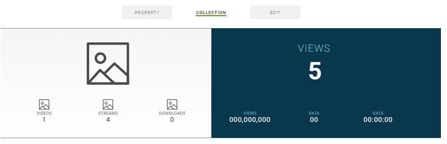

# Introduction

This topic provides information on the Content Console's data artifacts monitoring capabilities.

## Data Collection for Content Console Artifacts

The Content Console compiles monitoring data related artifacts added to the Content Console and tracks the actual number of artifacts that are added to the Content Console.

This data can be useful to gauge overall number of assets, balance of content in a particular Property or Collection, number of Published versus Private videos, etc.

## Report Details

| Report Name | Description   |
|:----------------|:--------------------------------------|
| Collection Interval  | Immediately throughout the content management cycle. |
| Visibility  | Organization Administrators and Publishers |
| Performance Tracking  | Views, Videos, Streams, Apps, Members, Properties, Collections |

## Monitoring Reports

The following monitoring reports are provided:

## Totals per Organization

Totals are presented in the blue information box on **Organization Home > Dashboard**.

| Statistic | Description   |
|:----------------|:--------------------------------------|
| Videos and Streams  | Total number of videos and streams added to the Organization. |
| Apps  | Total number of applications added to the Organization. |
| Members  | Total number of members in the Organizations (i.e., account holders) |
| Properties  | Total number of properties added to the Organization. |

## Totals by Property Summary

Information and totals presented for each property listed on the **Organization Home > Dashboard > Property**.

| Name | Description   |
|:----------------|:--------------------------------------|
| Last Updated | Date and time property last updated. |
| Collections  | Total number of collections defined in the property. |
| Videos  | Total number of Video on Demand (VoD) videos added to the property. |
| Streams  | Total number of live streams added to the property. |

## Property Sort Controls

| Name | Sorts properties..   |
|:----------------|:--------------------------------------|
| Title | Alphabetically by title. |
| Recent  | Based on most recently updated. |
| Active  | Based on published state (i.e., published or saved and not yet published) |
| Inactive  | Based on whether property is archived. |

## Totals for Property Details

Totals are presented in the blue information box on **Organization Home > Dashboard > Property > Property Details**.

| Statistic | Description   |
|:----------------|:--------------------------------------|
| Views  | Total number of times the property was viewed (regardless of published state). |
| Apps  | Total number of applications associated with the current property and videos collections. |
| Members  | Total number of members that have privileges to manage or view videos in the property (i.e., account holders) |
| Collections  | Total number of collections defined in the property. |

## Totals by Collection Summary

Information and totals presented for each property listed on the **Organization Home > Dashboard > Property > Collection**.

| Name | Description   |
|:----------------|:--------------------------------------|
| Last Updated | Date and time property last updated. |
| Collections  | Total number of collections defined in the property. |
| Videos  | Total number of Video on Demand (VoD) videos added to the property. |
| Streams  | Total number of live streams added to the property. |

## Collection Sort Controls

| Name | Sorts collections..   |
|:----------------|:--------------------------------------|
| Title | Alphabetically by title. |
| Recent  | Based on most recently updated. |
| Active  | Based on video published state (i.e., saved and not yet published) |
| Staging  | Based on video published state (i.e., published and is live or pending configured start time). |

## Totals for Collection Details

Totals are presented in the blue information box on **Organization Home > Dashboard > Property > Collection**.

| Statistic | Description   |
|:----------------|:--------------------------------------|
| Views  | Total number of times Video on Demand (VoD) videos or live streams in the collection have been viewed (regardless of published state). |
| Members  | Total number of members that have privileges to manage or view videos in the collection (i.e., account holders) |
| Session Time  | Total time Video on Demand (VoD) videos or live streams in collection have been viewed. |
| Videos  | Total number of Video on Demand (VoD) videos in collection. |
| Streams  | Total number of live streams in the collection. |
| Downloads  | Total number of Video on Demand (VoD) videos in the collection that have been downloaded. |

