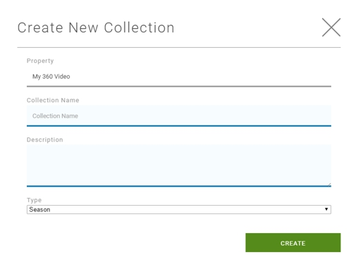

# Define Video Collection

Within each Property you then define a Collection:

- A Collection is a sub-category of a Property (e.g., TV Series Name).
- After adding a new video asset, you then assign it to a Property and Collection.
- Videos in a Collection can be reordered.
- You can reassign a video to a different Property and Collection.
- Within each Collection you also define a Season that represents a subcategory of the collection (i.e. Season, Series, Year, or Custom)

To define a collection:

1. In **Home > Properties > Property Name**, select **+Collection**. The *Create New Collection* pop-up displays.

3. Enter the collection name, description, and type, then **OK**. The *Collection* page displays.
