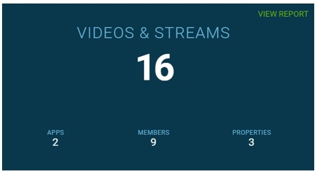

# Introduction

This topic provides information on the Content Console's data monitoring capabilities.

## Data Collection Areas

The Content Console compiles monitoring data related to live and on demand video streams. Data is collected for external video usage and internally for console artifacts.

### Video Usage (External)

Usage monitoring is performed on external Video on Demand (VoD) and Live Streams. Statistical data can help you determine audience size, number of unique visitors, peak traffic time, etc. and can be used to optimize your video outreach strategy.

| Report Name | Description   |
|:----------------|:--------------------------------------|
| Collection Interval  | Daily |
| Visibility  | Organization Administrators and Publishers |
| Report Types  | PDF |
| Performance Tracking  | Views, Page Loads, Session Time, Locality, Downloads |

Note: Video Usage data is presented in the blue screen area.

### Content Console Artifacts (Internal)

Usage monitoring is performed for Content Console Artifacts and tracks the actual number of artifacts that are added to the Content Console. This data can be useful to gauge overall number of assets, balance of content in a particular Property or Collection, number of Published versus Private videos, etc.

| Report Name | Description   |
|:----------------|:--------------------------------------|
| Collection Interval  | Immediately throughout the content management cycle. |
| Visibility  | Organization Administrators and Publishers |
| Performance Tracking  | Views, Videos, Streams, Apps, Members, Properties, Collections |

## Data Collection Process

* Data to be captured is defined in a business definition.
* Based on this definition raw data for Video on Demand (VoD) and live stream activity is collected.
* The data is then stored and segmented on a *per day* basis.
* The captured data is then transformed into metrics, analyzed, and summarized and grouped (e.g., daily, all).
* Data presentation is segregated based on collection point (i.e., external or internal).
* Collected data is then presented in a series of data tables on the Dashboard, Property, and Collection pages.

## Analytic Reports

The following analytics reports are provided:

### User Activity Statistics by Date / Total

| Report Name | Description   | Platform  |
|:----------------|:--------------------------------------|--------------------------|
| Total Page Loads    | Total number of times a page containing a published video or live stream was accessed.  | Web, Android, iOS |
| Total Views     | Total number of times a published video or live stream video that started playing.    | Web, Android, iOS |
| Unique Views     | Total number of unique viewers per Video on Demand (VoD) or Live Stream.     | Web, Android, iOS |
| Total Session Time  | Total time user spent on page containing a published video or live stream.  | Web, Android, iOS |
| Average Session Time  | Average time user spent on page containing a published video or live stream.  | Web, Android, iOS |
| Locality  | Total views segmented by geographic region (i.e., county, region, and city)  | Web, Android, iOS |
| Total Times Downloaded  | Total number of times Video on Demand (VoD) was downloaded  | Android, iOS |

### Platform Activity Statistics by Date / Total

| Report Name | Description   | Platform  |
|:----------------|:--------------------------------------|--------------------------|
| Total Page Loads    | Total number of times a page containing a published video or live stream was accessed.  | Web, Android, iOS |
| Total Views     | Total number of times a published video or live stream video that started playing.    | Web, Android, iOS |

## Dashboard View Reports

## Property View Reports

## Collection View Reports

## Saving a Report

* Video usage reports are auto-generated the end of each daily cycle and saved to a PDF file.
* The PDF files can be viewed by selecting View Report blue screen area of Dashboard, Property, and Collection pages.
* When the report loads, save it using your standard operating system save function.  
