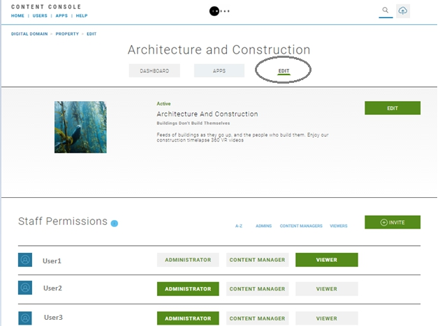

#	Introduction

This topic provides information about Content Console staff permissions and supported roles.

## What is a staff permission?

A staff permission allows a Content Console account owner a level of access to console functionality based on an assigned role.

* All permissions are assigned at the Property level.
* Administrators send email invitations to potential staff members using the **+Invite** function.
* Invitations specify what role a member will serve and includes a summary of what tasks the member will have permission to perform in the role.  
* Administrators can assign Content Managers rights to invite members (i.e., Content Managers, Viewer).

## How do I access the staff permissions page?

You can access the *Staff Permissions* page by selecting a property on the Organization Home page, then the **Edit** menu bar on a specific Properties page.  

**Organization Home > Select Property Name > Edit**

## What staff roles are supported?

**Administrators:**

* Create new organizations and properties
* Create and manage apps including API keys and configuration items
* Add and modify property access permissions

**Content Managers:**

Content managers will upload, manage, and edit all necessary content, and associated metadata required to publish content to consumers including asset descriptions and graphics/artwork for featuring or showcasing the content.

This role is broken into the following categories:

*Contributor:*

* Create and publish live stream
* Upload VOD content
* Add external VoD content

*Editor:*

This category includes all tasks a Contributor can perform plus:

* Manages property settings
* Create a support ticket
* View documentation
* Copy/move content between properties
* Create a new version of VoD / live stream

*Admin/Owner:*

This category includes all tasks an Editor/Contributor can perform plus:

* Remove content
* Download app configuration items (e.g., API Keys, Configuration Files, etc.)
* Add and modify property access permissions

**Viewers**

This role can view all published content and settings, except for staff permission settings. This role is typically designated for support staff.

## How do I invite staff to the content console?

If you are a site administrator you can invite staff to your organization by selecting the **+Invite** in the *Staff Permissions* section and specifying the email address of the invitee.

## Where can I view a list of staff members that are part of my organization?

The **Users** section of the Content Console includes list of organization staff members. Each listing includes name, screen name, and join date.

## Can I send a staff invitation to someone who is not a member of the Content Console?

Yes, the invitee must first contact the site administrator and request an account. Once the account is approved and the invitee is a member, they can accept the staff invitation. The invitation email provides instructions if you are not currently a member.

## How do I contact my account administrator?

The **Organization Home > Dashboard** menu includes a "Contact your company's administrator" section that provides instructions on how to contact your site administrator.  
