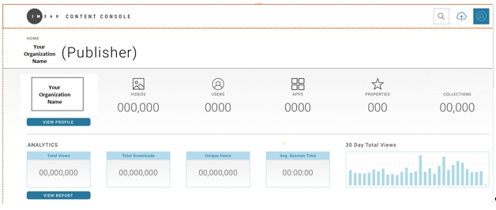
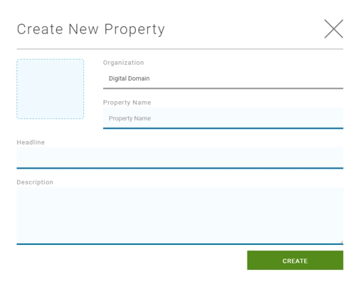
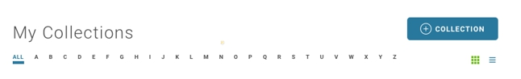

# Publishing a Hosted Video

The Content Console offers a flexible video publishing platform where you can tailor your configuration workflow based on your requirements and availability of your video digital assets.

The following tutorial illustrates how to publish a video that is hosted on the Content Console.

# **Part 1: Configure Video Property and Collection**

## Step 1: Launch the Content Console

1. Launch the Content Console and log in using your credentials. The *Home* page displays.

## Step 2: Define Video Property

The first step in the video publishing process is to define a Property. A Property has the following characteristics:

* A Property represents the top-level branding element of your videos (e.g., TV Network).
* A video must be added directly to a Property.
* A list of available Properties display on the Content Console Home page.
* A video can be reassigned to a different Property after it is uploaded.

**To define a property:**

1. On the **Home** page go to **Properties**.
2. Select **+Property**. The *Create a New Property* pop-up displays.

3. Enter the Property name, headline, and description, then **Create**. The new property is added to the *Properties* page listing.

## Step 3: Define Video Collection

Within each Property you then define a Collection:

- A Collection is a sub-category of a Property (e.g., TV Series Name).
- After adding a new video asset, you then assign it to a Property and Collection.
- Videos in a Collection can be reordered.
- You can reassign a video to a different Property and Collection.
- Within each Collection you also define a Season that represents a subcategory of the collection (i.e. episode #, etc.)

To define a collection:

1. In **Home > Properties > Property Name**, select **+Collection**. The *Create New Collection* pop-up displays.

3. Enter the collection name, description, and type, then **OK**. The *Collection* page displays.

# Part 2: Define Basic Video information

This section allows you to set the property and collection the video is contained in, and define the video metadata (i.e., title, description, tags).

## Step 1: Select Video Upload Method

1. In **Home > Properties > Property Name > Collection**.
2. In the collection select Upload Video (**+Upload Video**).
3. On the Uploader screen, select **Hosted Video**.

## Step 2: Select a Property

Change the default property assigned to your video and group your video in a collection. Note that both steps are required.

1. In **Select a Property** section, the currently assigned property is selected. To reassign the current video to a new property, select it from the drop-down.
2. After you select the property, the **Select a Collection"** drop-down displays and presents a list of collections associated with the current property. Select a collection to assign to the video.

## Step 3: Define Video Metadata

Metadata is used to uniquely identify the characteristics of each video.

* Videos can be tagged with metadata including Title, Description, and Search Tags.
* The default language for metadata is *English*.
* A Consumer will see the metadata on websites where a video is posted.  
* A Publisher can search for metadata in the Content Console.
* The Add Language function allows you to add a new metadata instance to a video profile.
* Content for additional languages can be defined in a Excel template and uploaded to the Content Console.

**Title (Required)**

* Effective titles summarize the video subject.
* They typically contain 5 words are less.
* Use descriptive keywords that grab a viewers attention.
* Should make sense out of context when they appear in search research.

**Description**

* Effective descriptions are concise (e.g., a small paragraph or lead-in sentence with bullet points).
* Should include exciting descriptions about video topic that will attract viewers attention.
* Should include hashtags (#) so they can be easily promoted on social media site.
* Should include credits associated with video creator, participants, actors, promoters, etc.

**Search Tags**

* Search tags help to promote your video on social media sites and search engines.
* Should contain keywords on who you are (individual, business, event, etc.)
* To gain an edge on coverage, perform research on competitors, sites most relevant to your video subject, and tag names.
* Search tags must be comma separated.

**To define video metadata:**

1. Go to the **Primary Language** section.
2. Enter the Title and Description for your video.
3. Enter one or more Tags (comma separated).

## Step 4: Configure Video Security

Throughout the publishing cycle, your videos will require different levels of security for access, downloading, and sharing to social networks. Video access levels include:

* **Private** - Video can be accessed by the console user who uploaded it.
* **Internal** - Video can be accessed by the console administrator and designated console users.
* **Public** - Video is visible to external consumers and can be accessed by console administrator and designated console users.
* The default setting is *Private*.

**As a best practice, set your video to private for the initial upload. You will need to add key art and set the broadcast time in post upload activities.**

**To configure video security:**

1. Go to the **Who can see your video?** section.
2. Select a radio button to set the access level.

## Step 5: Enable / Disable Video Downloading

You can set whether you want to enable or disable the ability for external consumer to download video.

* Option uses download method supported by website or device.
* Consumer must comply with video download terms of service of website or device.
* The default setting is *No*.

**To enable / disable video downloading:**

1. Go to the **Can users download your video?** section.
2. Select a radio button to enable/disable video download (i.e., Yes/No).

## Step 6: Set Video Blind Spot

Because your 360 video is created using multiple cameras, it’s possible your video output could include some clipping of content referred to as a "Nadir Blind Spot."

* The blind spot represents the position where the camera rig is supported and the tripod point is either left out of the video or the images are pinched together to eliminate the hole.

* The blind spot is usually corrected in post-production and filled in to imply a fully captured 360 image.

* The blind spot is typically filled by superimposing footage in that area or by inserting a “black” image at the nadir of the 360 video. The blind spot can then be used to populate with advertising space, navigations, or other uses.  

If your video includes a blind spot and you have not adjusted it in post-production, you can designate the blind spot location (Top or Bottom) and add a custom photo, logo, or icon to fill the blank space.

**To configure blind spot and projection:**

1. Go to **Video Blindspot?** and configure as follows:
2. If Projection = Flat, Blind Spot = None
3. If Projection = Spherical and video includes a Blind Spot, Blind Spot = Top or Bottom
4. If Projection = Spherical and video does not include a Blind Spot, Blind Spot = None

## Step 7: Set Video Projection

Indicate what type of video you will be uploading.

* **Flat** - This mode supports Monoscopic 360° videos. This video type is typically filmed with a single camera and stitched together to form a single equirectangular video.
* **Spherical** - This video type is usually filmed using two or more cameras and supports the use of HMD devices. Characteristics include:
      * Uses stereoscopic technique to render images so there is a slight offset between your left and right eye.
      * This view creates and impression of depth a full 360 experience.

**To set video projection:**

1. Go to **Video Projection?**.
2. Select a radio button to set video projection (i.e., Spherical or Flat).

## Step 8: Select Video Category

You can assign a category to video to make it easier for consumers to find (e.g., Entertainment, Sports, Music, Action, Family, etc.).

**To set video category:**

1. Go to **Video Category Type**.
2. From the drop-down select a category.

# Part 3: Upload Hosted Video

The upload video process allows you to upload a VoD video. Supported video and audio requirements include:

| Type         | Description            |
|:-----------------|:-------------------------------------|
| Video Type      | On Demand (VoD)             |
| Video Format    | MP4 HD (1040p), MP4 (2K), and **MP4 (4K)* |
| Audio Compression and Encoding Scheme        | Advanced Audio Coding (AAC)                             |

See [Video Publishing Requirements](videopublishrequirements.md) for prerequisite steps and video and audio requirements.

**To upload a hosted video:**

1. Go to the **Upload Video** section
2. Use the **Drag and Drop** or **Browse** method to perform the upload. A progress indicator will display while the video is uploading.
3. After the upload is complete, you will see a **Ready to continue?** confirmation prompt.
4. Confirm that your **Basic Video Information** and **Video Settings** are correct, then select **Publish**.

## Part 4: Manage Video Profile

After your video is uploaded, the final step in the configuration process is to review and update your video details, upload video key art and set the video broadcast time.

## Step 1: Review Video Details

The Video Details section allows you to review the current settings assigned to the video. You can also test / play the video in the Content Console, or use the embed a video link to test the video.

| Option / Setting         | Description            |
|:-----------------|:-------------------------------------|
| Views    | Displays the number of video views            |
| Uploaded    | Displays the date and time video was uploaded            |
| Visibility Settings    | Displays the current visibility setting for the video (Private, Internal, Public)            |
| Allow Downloads    | Displays video download setting Yes/No            |
| Allow Sharing    | Displays video sharing setting Yes/No            |
| Allow Comments    | Displays video comments setting Yes/No            |
| File Size    | Displays video file size            |
| Duration    | Display video play time            |
| Embed Link    | Displays video player and embed link.             |
| Users    | Displays number of users in each role that has access to your video (Admins, Content Managers, Viewers)   |         
**To view video details:**

1. Go to **Home > Properties > Collection > Video**.
2. Select **Video Details**.
3. Review the video information. You can test the video by playing it, or using the embed video link.
4. To update video settings, go to the **Edit** section.

## Step 2: Add Key Art

*Key Art* is an still image file that is used to showcase your video. It typically uses a memorable image or icon that represents the essence of the story or topic presented in a video. Key art is also referred to as a *thumbnail*. When your video was initially uploaded a thumbnail was assigned as the default start page.

* You upload key art during the video publishing phase.
* Key Art displays on your video profile, property, and collection pages.

Supported key art size specifications include:

| Key Art Setting       | Description            |
|:-----------------|:-------------------------------------|
| Image Size    | 16:9, 1600 x 825     |
| Format    | 4K           |
| Live Area    | Square, 825 x 825           |
| Special Effects | Key Art will center on the x/y axis. A parallax effect can be applied to your Key Art image.  |

**To upload key art:**

1. Go to **Home > Properties > Collection > Video**.
2. Select **Edit**.
3. Click the video thumbnail and upload a key art file using the dialog box.

## Step 3: Set Broadcast Time

The time you set your video to broadcast is based on many factors. For example:

* You arrangements with web providers to post your video at a designated time.
* You have considerations relating to the geographical area / time zone where your video will be initially broadcast.
* You may be sequencing the premiere of a video based on an event or product launch, etc.
* If your video security is set to Private or Internal, set your video to "Public" in the **Video Information > Who can see your video?** section prior to the Broadcast time.

**To set a broadcast time:**

1. Go to **Home > Properties > Collection > Video**.
2. Select **Edit**.
3. Use the drop-down menus to set the date and time the video will broadcast. The default is the current date and time.
3. If you are ready to publish the video, select **Review** to continue, or **Save for Later** to commit your changes and resume publishing this video at a later time. Your video will display in the Production Area on the **Home**. page.
4. Make sure your video is set to "Public" in the **Who can see your video?** before the broadcast time.

## Step 4: Review Video

The Review Video Profile page displays a final presentation of your video configuration.

1. Review the content for accuracy.
2. Verify that it represents the message and style you want to present.
3. Verify that the image URL presented launch to the correct page and work properly.
4. Verify that all referenced websites are correct.
5. Select the edit icon to make any adjustments.

## Step 5: Publish Video

1. If you are happy with the video configuration, click **Publish**.
2. Your video will go live on all the sites posted based on your designated Broadcast Time.
