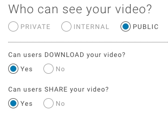
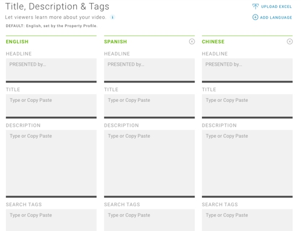
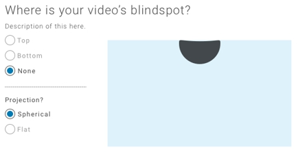
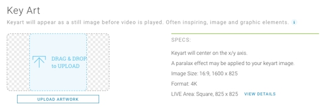
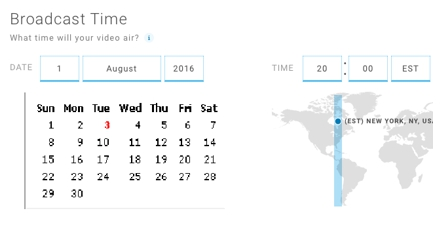

# Publishing a Video using the Content Console

The Content Console offers a flexible video publishing platform where you can tailor your configuration workflow based on your requirements and availability of your video digital assets. During the video publishing process videos reside in the *Production Area* until they are Published.

For example, if you upload a video, perform management tasks (i.e., add description, key art, etc.), but one or more of the digital assets is not available, the video is stored the Production Area. When you add the additional assets and **Publish** the video, the video is removed from the Production Area.

The following tutorial illustrates how to publish a video using the Content Console.

## Step 1: Launch the Content Console

1. Launch the Content Console and log in using your credentials. The *Home* page displays.

## Step 2: Define Video Property

The first step in the video publishing process is to define a Property. A Property has the following characteristics:

* A Property represents the top-level branding element of your videos (e.g., TV Network).
* A video must be added directly to a Property.
* A list of available Properties display on the Content Console Home page.
* A video can be reassigned to a different Property after it is uploaded.

**To define a property:**

1. On the **Home** go to **My Properties**.

2. Select **+Property**. The *Add Property* pop-up displays.
3. Enter the Property name and description, then **OK**. The *Property* page displays.

## Step 3: Define Video Collection

Within each Property you then define a Collection:

- A Collection is a sub-category of a Property (e.g., TV Series Name).
- After adding a new video asset, you then assign it to a Property and Collection.
- Videos in a Collection can be reordered.
- You can reassign a video to a different Property and Collection.
- Within each Collection you also define a Season that represents a subcategory of the collection (i.e. episode #, etc.)

To define a collection:

1. In **Home > Property**, select **+Collection**. The *Add Collection* pop-up displays.

3. Enter the Collection name, description, and seasons, then **OK**. The *Collection* page displays.

## Step 4: Add Video

The add video process involves selecting a video type and specifying camera label, URL, and video format details.

* Supported video types include **On Demand (VOD)** and **Live Stream**.
* Supported video formats include **MP4 HD (1040p)**, **MP4 (2K)**, and **MP4 (4K)**.
* Supported audio compression and encoding scheme is **Advanced Audio Coding (AAC)**
* See [Technical Specifications](technicalspecifications.md) for detailed video and audio requirements.

Upload Method:

* **VOD** - Drag & Drop or Browse upload method.
* **Live Stream** - Link to the following external URLs types:
  * Origin URL - Input the publishing point URL where the live stream is originally hosted.
  * Return URL - Input the redirection URL to that the viewer will return to after the live-stream
   concludes.
  * Meta URL - Input the meta URL that will typically upload a file that contains modified instructions on how to render particular videos in the player.

Adding URL Labels:

* Each external URL should be annotated with a unique camera label.
* For a live stream using multiple camera angles, add a URL for each camera angle and specify a camera label that uniquely identifies the camera angle and characteristics.

**To add a video:**

1. Go to the **My Collections** section and select **Add a New Video**. The *Upload Video* page displays.
2. Select the **Video Type** (Video on Demand or Live Stream).

For Video On Demand:
1. Use the **Drag and Drop** or **Browse** method to perform the upload.

For Live Stream:
1. Use the **Link to an External URL** option. Input Origin, Return, and Meta URLs.
2. Select video formats MP4 HD (1040p) or MP4 (4K).
2. If you are using multiple camera angles, add an external URL for each angle and add a descriptive Camera Label to identify the link.

3. On the Architecture and Construction page, specify the Stream Name, Description, and URLs.
   - Origin URL - Input the publishing point URL where the live stream is originally hosted.
   - Return URL - Input the redirection URL to that the viewer will return to after the live-stream
   concludes.
   - Meta URL - Input the meta URL that will typically upload a file that contains modified instructions on how to render particular videos in the player.

## Step 5: Set Season and Property

After you upload your video, you have the option to change the Property and group the video in a Season.

1. Go to **Set Season and Property**. The Property associated with the current video displays.
2. If you would like to reassign the current video to a new Property, select it from the drop-down and also select a Season.
3. Select **Next** to continue, or **Save for Later** to commit your changes and resume publishing this video at a later time. Your video will display in the Production Area on the **Home**. page.

## Step 6: Configure Video Security

Throughout the publishing cycle, your videos will require different levels of security for access, downloading, and sharing to social networks.

The **Video Information > Who can see your video?** section allows you to configure the following:

**Video Access**

* **Private** - Video can be accessed by the console user who uploaded it.
* **Internal** - Video can be accessed by the console administrator and designated console users.
* **Public** - Video is visible to external consumers and can be accessed by console administrator and designated console users.
* The default setting is *Private*.

**Download Video**

* Enable / Disable ability for external consumer to download video.
* Uses download method supported by website or device.
* Consumer must comply with video download terms of service of website or device.
* The default setting is *No*.

**Share Video**

* Enable / Disable social sharing of videos.
* Available social sharing networks is limited to those supported by the website or device a video is published on.
* * The default setting is *No*.

**To configure video security:**

1. Go to **Video Information > Who can see your video?** and set the following options:
2. Video access (Private, Internal, or Public).
3. **Can users DOWNLOAD your video?** (Yes / No).
4. **Can users SHARE your video?** (Yes / No)

## Step 7: Define Video Metadata

Metadata is used to uniquely identify the characteristics of each video.

* Videos can be tagged with metadata including Headline, Title, Description, and Search Tags.
* The default language for metadata is *English*.
* A Consumer will see the metadata on websites where a video is posted.  
* A Publisher can search for metadata in the Content Console.
* The Add Language function allows you to add a new metadata instance to a video profile.
* Content for additional languages can be defined in a Excel template and uploaded to the Content Console.

**Headline**

* Effective headlines summarize the video subject.
* They typically contain 5 words are less.
* Use descriptive keywords that grab a viewers attention.
* Should make sense out of context when they appear in search research.

**Description**

* Effective descriptions are concise (e.g., a small paragraph or lead-in sentence with bullet points).
* Should include exciting descriptions about video topic that will attract viewers attention.
* Should include hashtags (#) so they can be easily promoted on social media site.
* Should include credits associated with video creator, participants, actors, promoters, etc.

**Tags**

* Tags help to promote your video on social media sites and search engines.
* Should contain keywords on who you are (individual, business, event, etc.)
* To gain an edge on coverage, perform research on competitors, sites most relevant to your video subject, and tag names.
* Tags must be comma separated.

**To define video metadata:**

1. Go to **Video Information > Title, Description, and Tags**.
2. Enter the Headline, Title, and Description for your video.
3. Enter one or more Tags (comma separated).
4. Select **Next** to continue, or **Save for Later** to commit your changes and resume publishing this video at a later time. Your video will display in the Production Area on the **Home**. page.

**To add a language:**

1. Go to **Video Information > Title, Description, and Tags**.
2. Select **Add Language**.
3. If you have previously defined video metadata for the current video, you can copy the content and translate.
4. If you chose the Excel spreadsheet option, select Upload Excel to load the spreadsheet. The metadata instance will be auto-populated with the Excel data.  
5. Select **Next** to continue, or **Save for Later** to commit your changes and resume publishing this video at a later time. Your video will display in the Production Area on the **Home**. page.

## Step 8: Set Blind Spot Position (Spherical Video)

Because your 360 video is created using multiple cameras, it’s possible your video output could include some clipping of content referred to as a "Nadir Blind Spot."

* The blind spot represents the position where the camera rig is supported and the tripod point is either left out of the video or the images are pinched together to eliminate the hole.

* The blind spot is usually corrected in post-production and filled in to imply a fully captured 360 image.

* The blind spot is typically filled by superimposing footage in that area or by inserting a “black” image at the nadir of the 360 video. The blindspot can then be used to populate with advertising space, navigations, or other uses.  

If your video includes a blind spot and you have not adjusted it in post-production, you can designate the blind spot location (Top or Bottom) and add a custom photo, logo, or icon to fill the blank space.

**To configure blind spot and projection:**

1. Go to **Final Video Details > Where is your video's blind spot?** and configure as follows:
2. If Projection = Flat, Blind Spot = None
3. If Projection = Spherical and video includes a Blind Spot, Blind Spot = Top or Bottom
4. If Projection = Spherical and video does not include a Blind Spot, Blind Spot = None

## Step 9: Add Key Art

*Key Art* is an still image file that is used to showcase your video. It typically uses a memorable image or icon that represents the essence of the story or topic presented in a video. Key art is also referred to as a *thumbnail*.

* You upload key art during the video publishing phase.
* Key Art displays on your video profile, property, and collection pages.

Supported key art size specifications include:

* Image Size - 16:9, 1600 x 825
* Format - 4K
* Live Area - Square, 825 x 825

Special effects:

* Key Art will center on the x/y axis.
* A parallax effect can be applied to your Key Art image.

**To upload key art:**

1. Go to **Final Video Details > Key Art**.
2. **Drag & Drop** or **Browse** to upload graphic file.
3. Select **Upload Artwork**.

## Step 10: Set Broadcast Time

The time you set your video to broadcast is based on many factors. For example:

* You arrangements with web providers to post your video at a designated time.
* You have considerations relating to the geographical area / time zone where your video will be initially broadcast.
* You may be sequencing the premiere of a video based on an event or product launch, etc.
* If your video security is set to Private or Internal, set your video to "Public" in the **Video Information > Who can see your video?** section prior to the Broadcast time.

**To set a broadcast time:**

1. Go to **Final Video Details > Set Broadcast Time**.
2. Use the drop-down menus to set the date and time the video will broadcast. The default is the current date and time.
3. If you are ready to publish the video, select **Review** to continue, or **Save for Later** to commit your changes and resume publishing this video at a later time. Your video will display in the Production Area on the **Home**. page.
4. Make sure your video is set to "Public" in the **Video Information > Who can see your video?** before the broadcast time.

## Step 11: Review Video

The Review Video Profile page displays a final presentation of your video configuration.

1. Review the content for accuracy.
2. Verify that it represents the message and style you want to present.
3. Verify that the image URL presented launch to the correct page and work properly.
4. Verify that all referenced websites are correct.
5. Select the edit icon to make any adjustments.

## Step 12: Publish Video

1. If you are happy with the video configuration, click **Publish**.
2. Your video will go live on all the sites posted based on your designated Broadcast Time.

## Step 13: Manage Video Production Area

If selected the **Save for later** option on any video, go to the **My Production Area** section on the **Home** page, and complete the remaining publishing tasks.
