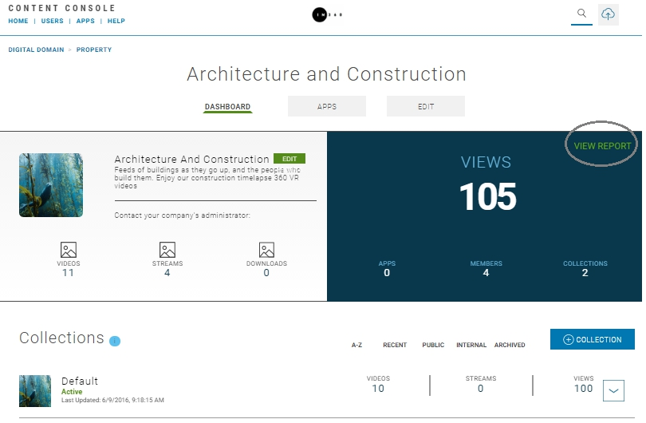

# Introduction

This topic provides information on the Content Console's video usage analytics capabilities.

## Data Collection for Video Usage

The Content Console compiles usage data for external Video on Demand (VoD) and Live Stream usage by mobile device applications, and websites where videos are embedded and viewed.

Statistical data can help you determine audience size, number of unique visitors, peak traffic time, etc. and can be used to optimize your video outreach strategy.

## Report Details

| Features | Description   |
|:----------------|:--------------------------------------|
| Collection Interval  | Daily |
| Visibility  | Organization Administrators and Publishers |
| Report Types  | HTML in Organization Home, Property, and Collection pages |
| Performance Tracking  | Views, Page Loads, Session Time, Locality, Downloads |

Note: **View Reports** link is available in the blue information box on Organization Dashboard, Properties, and Collection pages.

Figure: Example of Dashboard Information Box

## Data Collection Process

* Data to be captured is defined in a business definition.
* Based on this definition raw data for Video on Demand (VoD) and live stream activity is collected.
* The data is then stored and segmented on a *per day* basis.
* The captured data is then transformed into metrics, analyzed, and summarized and grouped (e.g., daily, all).
* Data presentation is segregated based on collection point (i.e., external or internal).
* Collected data is then presented in a series of data tables on the Dashboard, Property, and Collection pages.

## Analytic Reports

The following analytics reports are provided:

### User Activity Statistics by Date / Total

| Report Name | Description   | Platform  |
|:----------------|:--------------------------------------|--------------------------|
| Total Page Loads    | Total number of times a page containing a published video or live stream was accessed.  | Web, Android, iOS |
| Total Views     | Total number of times a published video or live stream video that started playing.    | Web, Android, iOS |
| Total Complete Plays   | Total number of times a page containing a published video or live stream was accessed and the video was played for its complete duration.  | Web, Android, iOS |
| Unique Views     | Total number of unique viewers per Video on Demand (VoD) or Live Stream.     | Web, Android, iOS |
| Total Session Time  | Total time user spent on page containing a published video or live stream.  | Web, Android, iOS |
| Average Session Time  | Average time user spent on page containing a published video or live stream.  | Web, Android, iOS |
| Locality  | Total views segmented by geographic region (i.e., county, region, and city)  | Web, Android, iOS |
| Total Times Downloaded  | Total number of times Video on Demand (VoD) was downloaded  | Android, iOS |

### Platform Activity Statistics by Date / Total

| Report Name | Description   | Platform  |
|:----------------|:--------------------------------------|--------------------------|
| Total Page Loads    | Total number of times a page containing a published video or live stream was accessed.  | Web, Android, iOS |
| Total Views     | Total number of times a published video or live stream video that started playing.    | Web, Android, iOS |

## Viewing a Report

* Video usage reports are auto-generated the end of each daily cycle and saved to an HTML Reports page.
* To view a report select **View Report** in the blue information box on Dashboard, Property, and Collection pages.

The following examples illustrate where you can view an analytics report:

 

## View Reports > Organization Dashboard

## View Reports > Property

## View Reports > Collection

