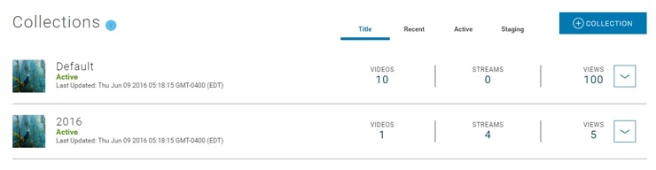

[Video Metadata](terms.md#video-metadata)  link in destination doc

[Video Metadata](#video-metadata) top of source doc  DO NOT NEED THIS PART

Video Metadata header of source doc

## Step 1: Launch the Content Console

1. Launch the Content Console and log in using your credentials. The *Home* page displays.

## Totals per Organization

Totals are presented in the blue information box on **Organization > Home**.

| Statistic | Description   |
|:----------------|:--------------------------------------|
| Videos and Streams  | Total number of videos and streams added to the Organization. |
| Apps  | Total number of applications added to the Organization. |
| Members  | Total number of members in the Organizations (i.e., account holders) |
| Properties  | Total number of properties added to the Organization. |

## Totals by Property Summary

Information and totals presented for each property listed on the **Properties Summary** on **Organization > Home**.

| Name | Description   |
|:----------------|:--------------------------------------|
| Last Updated | Date and time property last updated. |
| Collections  | Total number of collections defined in the property. |
| Videos  | Total number of videos added to the property. |
| Streams  | Total number of streams added to the property. |

## Property Sort Controls

| Name | Sorts properties..   |
|:----------------|:--------------------------------------|
| Title | Alphabetically by title. |
| Recent  | Based on most recently updated. |
| Active  | Based on published state (i.e., published or saved and not yet published) |
| Inactive  | Based on whether property is archived. |

## Totals for Property Views

Totals are presented in the blue information box on **Organization > Home > Property > Property Details**.

| Statistic | Description   |
|:----------------|:--------------------------------------|
| Views  | Total number of times the property was viewed (regardless of published state). |
| Apps  | Total number of applications associated with the current property and videos collections. |
| Members  | Total number of members that have privileges to manage or view videos in the property (i.e., account holders) |
| Collections  | Total number of collections defined in the property. |

## Collection Sort Controls

| Name | Sorts collections..   |
|:----------------|:--------------------------------------|
| Title | Alphabetically by title. |
| Recent  | Based on most recently updated. |
| Active  | Based on video published state (i.e., published or saved and not yet published) |
| Inactive  | Based on whether video in collection is archived. |
| Expand/Collapse Control  | Toggle that allows you to expand or collapse a property to view videos contained in the property. |

# Introduction

This topic provides information on the Content Console's data monitoring capabilities.

## Data Collection Areas

The Content Console compiles monitoring data related to live and on demand video streams. Data is collected for external video usage and internally for console artifacts.

### Video Usage (External)

Usage monitoring is performed on external Video on Demand (VoD) and Live Streams. Statistical data can help you determine audience size, number of unique visitors, peak traffic time, etc. and can be used to optimize your video outreach strategy.

| Report Name | Description   |
|:----------------|:--------------------------------------|
| Collection Interval  | Daily |
| Visibility  | Organization Administrators and Publishers |
| Report Types  | HTML in Organization Home, Property, and Collection pages |
| Performance Tracking  | Views, Page Loads, Session Time, Locality, Downloads |

Note: **View Reports** link is available in the blue information box on Organization Dashboard, Properties, and Collection pages.

Figure: Example of Dashboard Information Box

### Content Console Artifacts (Internal)

Usage monitoring is performed for Content Console Artifacts and tracks the actual number of artifacts that are added to the Content Console. This data can be useful to gauge overall number of assets, balance of content in a particular Property or Collection, number of Published versus Private videos, etc.

| Report Name | Description   |
|:----------------|:--------------------------------------|
| Collection Interval  | Immediately throughout the content management cycle. |
| Visibility  | Organization Administrators and Publishers |
| Performance Tracking  | Views, Videos, Streams, Apps, Members, Properties, Collections |

## Data Collection Process

* Data to be captured is defined in a business definition.
* Based on this definition raw data for Video on Demand (VoD) and live stream activity is collected.
* The data is then stored and segmented on a *per day* basis.
* The captured data is then transformed into metrics, analyzed, and summarized and grouped (e.g., daily, all).
* Data presentation is segregated based on collection point (i.e., external or internal).
* Collected data is then presented in a series of data tables on the Dashboard, Property, and Collection pages.

## Analytic Reports

The following analytics reports are provided:

### User Activity Statistics by Date / Total

| Report Name | Description   | Platform  |
|:----------------|:--------------------------------------|--------------------------|
| Total Page Loads    | Total number of times a page containing a published video or live stream was accessed.  | Web, Android, iOS |
| Total Views     | Total number of times a published video or live stream video that started playing.    | Web, Android, iOS |
| Total Complete Plays   | Total number of times a page containing a published video or live stream was accessed and the video was played for its complete duration.  | Web, Android, iOS |
| Unique Views     | Total number of unique viewers per Video on Demand (VoD) or Live Stream.     | Web, Android, iOS |
| Total Session Time  | Total time user spent on page containing a published video or live stream.  | Web, Android, iOS |
| Average Session Time  | Average time user spent on page containing a published video or live stream.  | Web, Android, iOS |
| Locality  | Total views segmented by geographic region (i.e., county, region, and city)  | Web, Android, iOS |
| Total Times Downloaded  | Total number of times Video on Demand (VoD) was downloaded  | Android, iOS |

### Platform Activity Statistics by Date / Total

| Report Name | Description   | Platform  |
|:----------------|:--------------------------------------|--------------------------|
| Total Page Loads    | Total number of times a page containing a published video or live stream was accessed.  | Web, Android, iOS |
| Total Views     | Total number of times a published video or live stream video that started playing.    | Web, Android, iOS |

## Viewing a Report

* Video usage reports are auto-generated the end of each daily cycle and saved to an HTML Reports page.
* To view a report select **View Report** in the blue information box on Dashboard, Property, and Collection pages.

The following example provides an example of an analytics report:

 

## View Reports > Organization Dashboard

## View Reports > Property

## View Reports > Collection

| Option / Setting         | Description            | Permission  |
|:-----------------|:-------------------------------------|------------|
| Update Key Art | Image that will display on video player. Select upload new image. | Update |
| Check Video | Performs master video file check. | Update |
| Video Origin    | Location where the video is hosted on the Digital Domain server. | Read-only |
| Video Title    | Title that summarizes video subject.          | Edit  |
| Headline    | Video headline caption.           | Edit |
| Description    | Video description.   | Edit |
| Visibility Settings  | Private, Internal, Public         | Update |
| Allow Downloads    | Video download setting Yes/No       | Update |
| Allow Sharing    | Video sharing setting Yes/No            | Update |
| Projection    | Video projection setting Flat/Spherical        | Update |
| Tag & Search Words    | List of search tags.        | Update |
| Views    | Number of video views.            | Read-only |
| Downloads    | Number of video downloads.    | Read-only |
| Uploaded    | Video upload time.        | Read-only |
| File Size    | Video file size.        | Read-only |
| Duration    | Video play time.            | Read-only |
| Users    | Displays number of users in each role that has access to your video (Admins, Content Managers, Viewers)   | Read-only |
| Distribution Apps | Displays a list of apps the current video is associated with | Read-only |

The following table shows page options and permission state:

| Option / Setting         | Description            | Permission  |
|:-----------------|:-------------------------------------|------------|
| Update Key Art | Image that will display on video player. Select **Upload Key Art**. | Update |
| Check Video | Performs master video file check. | Update |
| Source    | Location where the video is hosted on the Digital Domain server. | Read-only |
| Visibility Settings  | Private, Internal, Public         | Update |
| Allow Downloads    | Video download setting Yes/No       | Update |
| Allow Sharing    | Video sharing setting Yes/No            | Update |
| Category | Video Category. Select from dropdown. | Update |
| Languages | Add new language and enter metadata. | Update |
| Title    | Title that summarizes video subject.          | Edit  |
| Headline    | Video headline caption.           | Edit |
| Description    | Video description.   | Edit |
| Tags    | Video description.   | Edit |

| Projection    | Video projection setting Flat/Spherical        | Update |
| Tags & Search Words    | List of search tags.        | Update |
| Views    | Number of video views.            | Read-only |
| Resolution    | Video resolution    | Read-only |
| Uploaded    | Video upload time.        | Read-only |
| File Size    | Video file size.        | Read-only |
| Duration    | Video play time.            | Read-only |
| Users    | Displays number of users in each role that has access to your video (Admins, Content Managers, Viewers)   | Read-only |
| Distribution Apps | Displays a list of apps the current video is associated with | Read-only |

## Report Details

| Features | Description   |
|:----------------|:--------------------------------------|
| Collection Interval  | Daily |
| Visibility  | Organization Administrators and Publishers |
| Report Types  | HTML in Organization <!--- Home, Property, and Collection pages--->  |
| Performance Tracking  | Views, Page Loads, Session Time, Locality, Downloads |

### User Activity Statistics by Date / Total

| Report Name | Description   | Platform  |
|:----------------|:--------------------------------------|--------------------------|
| Total Page Loads    | Total number of times a page containing a published video or live stream was accessed.  | Web, Android, iOS |
| Total Views     | Total number of times a published video or live stream video that started playing.    | Web, Android, iOS |
| Total Complete Plays   | Total number of times a page containing a published video or live stream was accessed and the video was played for its complete duration.  | Web, Android, iOS |
| Unique Views     | Total number of unique viewers per Video on Demand (VoD) or Live Stream.     | Web, Android, iOS |
| Total Session Time  | Total time user spent on page containing a published video or live stream.  | Web, Android, iOS |
| Average Session Time  | Average time user spent on page containing a published video or live stream.  | Web, Android, iOS |
| Locality  | Total views segmented by geographic region (i.e., county, region, and city)  | Web, Android, iOS |
| Total Times Downloaded  | Total number of times Video on Demand (VoD) was downloaded  | Android, iOS |

### Platform Activity Statistics by Date / Total

| Report Name | Description   | Platform  |
|:----------------|:--------------------------------------|--------------------------|
| Total Page Loads    | Total number of times a page containing a published video or live stream was accessed.  | Web, Android, iOS |
| Total Views     | Total number of times a published video or live stream video that started playing.    | Web, Android, iOS |
